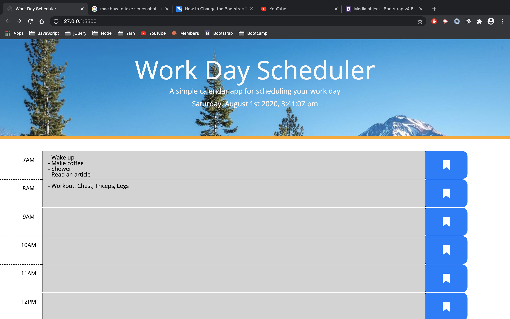
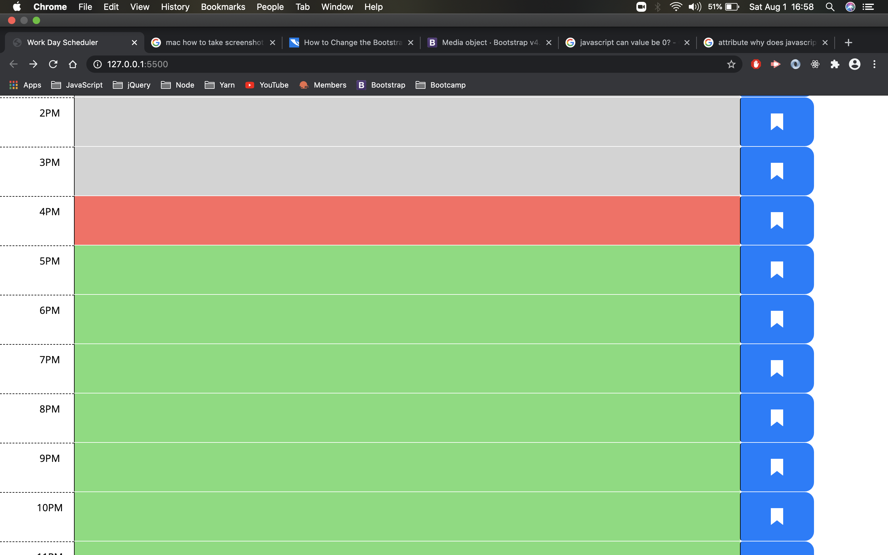
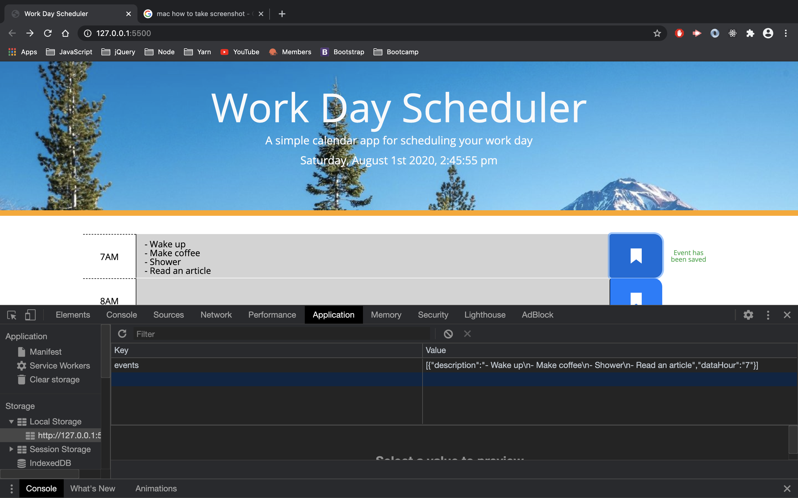
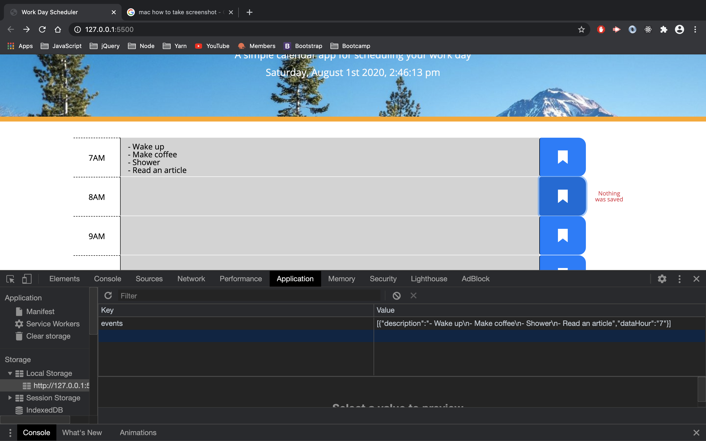
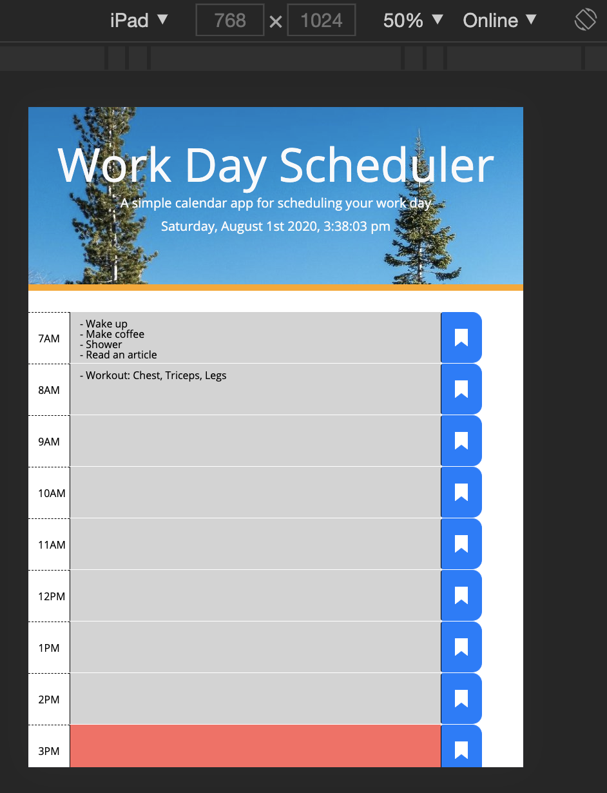
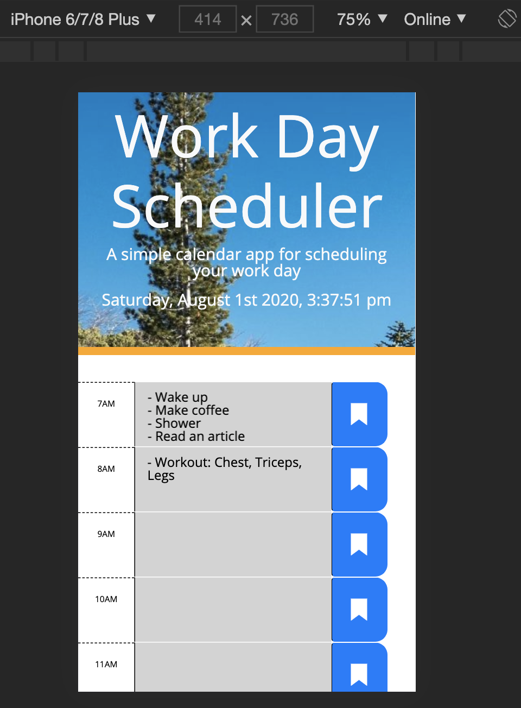
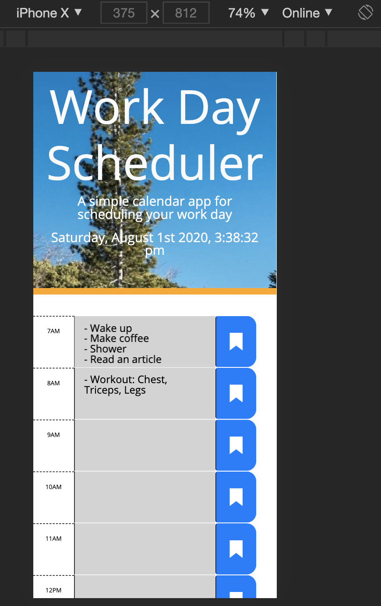
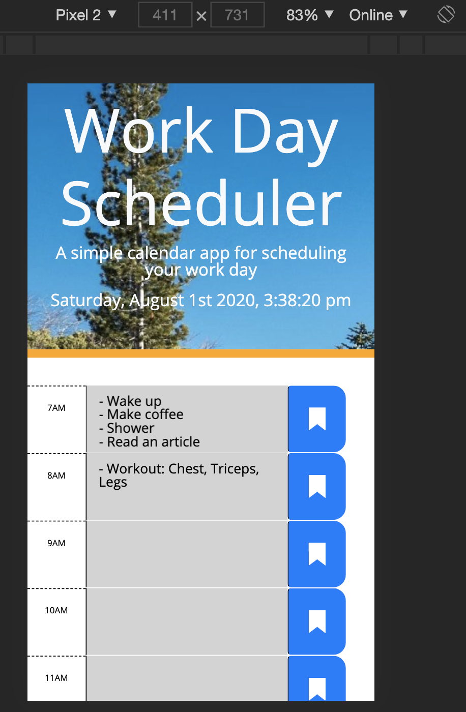

# Edward Reyes
Calendar Application

## Description:
Allows the user to save events for each hour of the day. Time-blocks are color coded to indicate whether it is in the past (grey), present (red), or future(green). Users can also enter events and save them in the browsers local storage so users can view their events later.

## Process:

### HTML & Moment.js
The app uses moment.js library to work with the date and time. I used it both to display the current day and time in the jumbotron, and also used to to color code time-blocks. All of these were done in a script tag in the index.html file. 

For each time-block, I used a span to display the hour, a textarea to store user's text, and a button to save. 

```
    <div class="time-block">
      <div class="row">
        <div class="col-2 col-md-1 hour">
          <span>7AM</span>
        </div>
        <textarea class="col-7 col-md-9" data-hour="7" value="7"></textarea>
        <button class="col-2 col-md-1 btn btn-primary saveBtn">
          
        </button>
        <div class="saveNotify text-success justify-content-center col-1" value="7">
          <span class="align-self-center"></span>
        </div>
      </div>
    </div> <!-- Time block -->
```
Each time-block has the has the same structure and I've repeated them throughout the html file for each hour until 12AM. For the button, I created my own save button icon using Adobe.xd and saved it as an SVG and included it in the button element.

### CSS & Bootstrap
I only created a @media rule in css to change the text size for the hours. For Bootstrap I used several classes to style the page. I used .container-fluid on he div that surrounds all the time-blocks to make the bootstrap responsive. I also added .col classes that have breakpoints to change their size when the viewport reaches a certain size.

### JavaScript
I have two functions and a click assigned to the save button event to save the events. The first function, called initEvents(),initializes the events array with the objects saved in the localStorage. The second function, called renderEvents(), assigns the appropriate textarea elements with the corresponding description.
The save button is assigned a click event, and I've added extra code that notifies the user if they either saved and event or not. An event is not save if it contains an empty string and notifies the user.

## Desktop 


## Time-blocks color coded
Time taken was at 4:58 PM


##  Save event & Save notification


##  Empty save notification
In the inspector, the empty event was not stored in local storage.


##  Responsive views
### iPad

### iPhone 6/7/8 

### iPhone X

### Pixel 2
